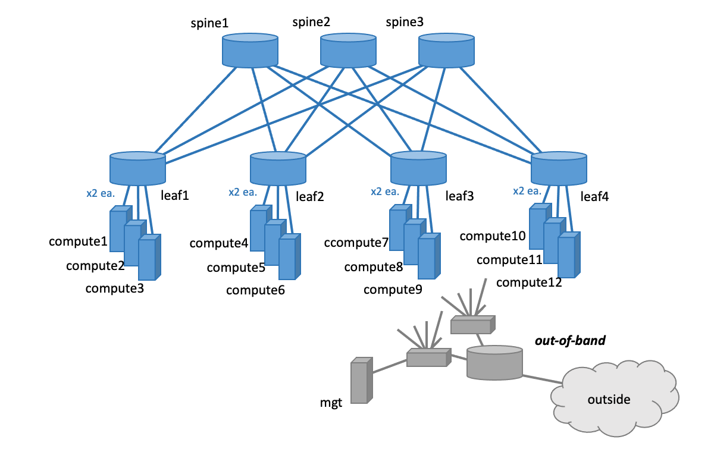

# CML Lab: NXOS Based, L3 Edge, CLOS Fabric

## Overview

A customer asked me the other day, how routing on a Linux networking would present itself in a dynamic container environment, if participating in routing?  Having an idea, but not knowing 100% of the mechanics, I had to build a quick lab to test.  In discussing further with a Cisco colleague of mine, they suggested that I should post the resulting work.  It is an interesting example of using the [Python client library](https://developer.cisco.com/docs/virl2-client/) supplied with [Cisco Modeling Labs](https://www.cisco.com/c/en/us/products/cloud-systems-management/modeling-labs/index.html), meta-data, Linux and Cisco networking devices that might prove useful to the CML community.  Also, there is some RSA key usage and password hashing examples that might come in handy.  My hope is that some of this work will be helpful to others developing their own CML labs or give a new perspective to how to go about creating a more programmatic workflow.

Rather than this being developed directly as a Python script, I present it as a notebook.  For those not familiar with [Project Jupyter](https://jupyter.org) or usually hearing it referred to in a data analysis context, its iPython-ish, cell-by-cell execution approach make it well suited for "NetDevOps" work.  It is easy for beginning Python programmers or those unfamiliar with a new module, to tackle material in bite sized chunks.  From an operational perspective, It has a natural feeling to the way we as networkers, work a problem.  Especially, when interacting with networking devices via programming interface.  It also has an ability to render images and Markdown within, yielding embedded documentation and creating highly portable work output.

The actual answer to the original container question?  Well, it is a bit "out of scope" for this repo or at least what I want to get into here.  However, I will say it was an interesting exercise.  In a nutshell: given [LXD](https://linuxcontainers.org/lxd/introduction) containers, [FRRouting](https://frrouting.org) on the Linux box, and a `redistribute connected` clause to the routing protocol, enabled a newly instantiated bridged network on a compute host to be immediately visible across the spine-leaf.  To keep matters simple, none of that day1 BGP/OSPF NXOS/FRRouting configuration is included here.  Rather, the focus is using the client library to bootstrap configure and start a running base infrastructure.

At the time, I also had an upcoming presentation where I needed to demonstrate [Ansible](https://docs.ansible.com/ansible/2.9/index.html), Cisco's [Network Service Orchestrator](https://www.cisco.com/c/en/us/products/cloud-systems-management/network-services-orchestrator/index.html) (NSO) and their interoperability/integration.  I incorporated some additional programming in this notebook to generate key configuration files for those tools.  I did leave that code in, illustrating the linkage between pre-boot configuration of lab devices and applying that same data to other outside configuration scripts.  Again, to keep things simple, none of the actual Ansible playbooks nor NSO product software is included to keep things scoped and for obvious licensing concerns.  However, this notebook will generate a lab specific ssh-config file for the lab (as in `ssh -F ssh-config [target]`), as well as Ansible inventory and configuration that you can easily deploy playbooks against.  More considerations in the details further down.

Most of the IP addressing is done programmatically, embedded with other work and in a very simplistic manner (utilizing node and link ID numbers in the formulation).  It is pushed to the nodes before they are started (as router or cloud-init config), via a call.  To round things out, the lab also demonstrates the use of its own out-of-band network, sitting behind a thin layer of NAT.  This supports outside tooling, a path for Apt package installs and to avoid overlap with other lab efforts that may be running in CML.

Finally, this is an adaptation of another CML lab that was originally built with a L2 edge with trunked vlans to the compute nodes and having EVPN-VXLAN overlay for the spine-leaf.  That is likely a better representation of what you would typically see in one of today's data centers.  However, I think it highlights the re-usability aspect of your work, when utilizing the CML client library.

Enjoy.

## Build Environment and Requirements

- Developed on macOS 11.4 (Big Sur)
- Uses Python 3.9.1 and pip 21.0.1 included in macOS (in a virtualized environment)
- Personally, I virtualize my environments with [Miniconda](https://docs.conda.io/en/latest/miniconda.html)... which worked fine with my typical 3.8.5 day-to-day environment.
- Requires CML Version 2.2.1 build 36 server (or later)**\*\***
- Rather resource intensive lab
  - Developed on CML server utilizing 32 cores and 256GB of memory
  - You likely need a minimum of 24 cores and 64GB of memory (mileage may vary, I have not tested to see what acceptable minimum that this can be run on)
- Using stock NXOS, Ubuntu and IOSv CML node/image definitions
- A minimum of the below needs to be installed:
```
$ pip3 install jupyter
$ pip3 install ansible #if planning to use
$ pip3 install passlib
$ pip3 install virl2_client
```
- See `requirements.txt` for specific module versions.

>**\*\*Note:** Prior to CML 2.2.1, Ubuntu interfaces were labeled as enp0s2, enp0s3, enp0s4, etc.  In 2.2.1 and going forward they will be prefaced as in ens2, ens3, ens4, etc.  If you try to run this against earlier CML version, without making adjustments, your Jinja2 rendering of `cloud-init` will fail (at Python cell 35).  To further complicate matters, the node definitions for Ubuntu in CML 2.2.1 build 36, start with ens3, instead of ens2.  In my case, I have editted `/var/local/virl2/refplat/diff/node-definitions/ubuntu.yaml` to start with ens2 (which my understanding, will be the default, in subsequent releases).  Verify Ubuntu node definitions, how interfaces are labeled and the numbering they begin with.  You may have to make some minor adjustment to either CML's node definition or my code (replacing ens2, ens3 and ens4 with ens3, ens4 and ens5)

- Expanding on the above note, it is worth mentioning that this notebook does very little in the way of error checking and/or exception handling that would otherwise be seen in typical script development.  The cell-by-cell style or working within the context of a notebook, tends to relax such considerations.  Any such additions would grow the amount of code and in my opinion defeat some of the purpose of developing ideas w/in Jupyter.
- Converting this to a Python script and putting into some form of service, I would strongly suggest considering the addition of appropriate error checking and exception handling.

## Topology



## Usage and Implementation Details

- To make ready for use:
```
$ python3 -m venv .venv
$ source .venv/bin/activate
$ pip3 install -r ./requirements.txt #or pip3 install what you plan to use
$ jupyter notebook #navigate the browser window that opens
```

- If you prefer to run Jupyter a bit more quietly and in the background you could consider making some alias for `nohup jupyter notebook > /dev/null 2>&1 &`.

- Jupyter is very intuitive and not that hard to pick up.  A quick search of the web will yield many tutorials, here is one such introduction on [Real Python's](https://realpython.com/jupyter-notebook-introduction/) website.

- Looking through `day0-nxos-l3-edge.ipynb` near the top, pay close attention to the ALL CAPs variables.  They tend to be a single place to change a variable, that has ramification, further down.  In my environments I general deploy the external connector with a bridged configuration.  I also utilize DHCP and DNS on that Ethernet rail, that the gateway router picks up on.  Change `LAB_IP = 'dhcp'` to an IP address and netmask, if you need static definition.

- You will need to make adjustments for your username and home directory.

- `VIRL_SERVER` should be set to your CML hostname or IP address.

- `JUMP_BOX` should be set to any intermediary jump box, otherwise `None`, if you are not situated as I am.

- `DNS_NAMESERVER` will need to be identified.

- Besides my own personal RSA keys, I have lab specific ones that I use.  You will need to make adjustments to fit your requirements and how you typically connect to machines.  I played with the idea of generating them keeping everything contained w/in the project director, but left it as is.  Later, I might update and change this (I welcome input on this or any other constructive criticism).

- The CML client library is utilized to create the lab, create the nodes, link the nodes, push out a boostrap config and bring up the lab.

- Along the way a handful of supporting configuration files are created, as well as the resulting VIRL topology file and extra metadata dumped to the directory.

- Besides [JMESPath](https://jmespath.org) support being embedded within Ansible, to query against JSON data, I would encourage you to take a second look at working with in on the command line.  Having worked quite a bit with XPath from a NETCONF/YANG perspective, the tool [ jmespath/jp](https://github.com/jmespath/jp), has a very familiar feel and an extremely effective way of parsing through your data.  As you work through this lab, you might find that work comes in handy for pulling out specific details in the JSON blob of lab metadata, beyond what is provided for in a CML topology file.  For example:

```
$ cat lab-data.json | jp "nodes.leaf1.interfaces.* | [?role=='fabric']"
[
  {
    "associated_link_id": "l49",
    "interface_id": "i106",
    "interface_label": "Ethernet1/9",
    "ip_address": "172.16.49.8",
    "mac_address": "52:54:00:0c:a1:45",
    "neighbor": {
      "interface": "Ethernet1/1",
      "ip_address": "172.16.49.7",
      "label": "spine3"
    },
    "netmask": "255.255.255.0",
    "role": "fabric"
  },
  {
    "associated_link_id": "l47",
    "interface_id": "i102",
    "interface_label": "Ethernet1/7",
    "ip_address": "172.16.47.8",
    "mac_address": "52:54:00:10:a8:b6",
    "neighbor": {
      "interface": "Ethernet1/1",
      "ip_address": "172.16.47.5",
      "label": "spine1"
    },
    "netmask": "255.255.255.0",
    "role": "fabric"
  },
  {
    "associated_link_id": "l48",
    "interface_id": "i104",
    "interface_label": "Ethernet1/8",
    "ip_address": "172.16.48.8",
    "mac_address": "52:54:00:05:78:17",
    "neighbor": {
      "interface": "Ethernet1/1",
      "ip_address": "172.16.48.6",
      "label": "spine2"
    },
    "netmask": "255.255.255.0",
    "role": "fabric"
  }
]
$
``` 

- As an example `ssh -F ssh-config leaf1` without needing a password.  A quick look at the running config will highlight you have all network adjacency addressed and up, but no routing protocols established.  I leave it to you to deploy either manual, Ansible or whatever fits your task at hand.

- If you would like to utilize as a basic Python script, Jupyter can make that conversion for you by issuing `jupyter nbconvert --to python day0-nxos-l3-edge.ipynb` and cleaning up with a bit of editing.

- If you are having trouble viewing the .ipynb file, try looking at via [online nbviewer](https://nbviewer.jupyter.org/github/charliefenwick/cml-nxos-l3-edge-fabric/blob/main/day0-nxos-l3-edge.ipynb).
